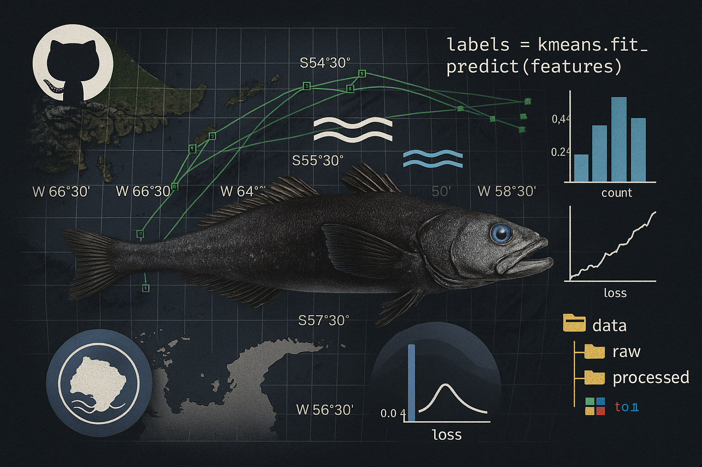

<p align="center">
  
</p>

# Predicción de Captura de Merluza Negra en Tierra del Fuego

Este proyecto aplica técnicas de Aprendizaje Automático para predecir la captura mensual de Merluza Negra en la provincia de Tierra del Fuego, Argentina, utilizando variables climáticas y oceanográficas.

##  Estructura del proyecto

Organizado según la arquitectura de [Cookiecutter Data Science](https://drivendata.github.io/cookiecutter-data-science/), con las siguientes carpetas:

- `data/` → Datos crudos y procesados
- `notebooks/` → Desarrollo de modelos y visualización
- `src/` → Scripts de procesamiento, features y modelos
- `reports/` → Gráficos y visualizaciones de resultados
- `docs/` → Entregables académicos y documentación

##  Herramientas utilizadas

- Python, Pandas, NumPy, scikit-learn
- Jupyter Notebook
- Git y GitHub
- Power BI (para visualización complementaria)

##  Autor

Cristian Couto — *Técnico Superior en Ciencias de Datos e Inteligencia Artificial*  
[GitHub](https://github.com/CristianCouto) · [LinkedIn](https://www.linkedin.com/in/CristianCouto)

# Predicción de Captura de Merluza Negra en Tierra del Fuego

En este proyecto se busca modelar y predecir la variable `captura` mensual utilizando los valores de `anom` (anomalía de temperatura superficial del mar, SST). El modelo utilizado corresponde a una regresión supervisada (lineal simple), entrenado sobre datos reales del año 2019.


## Estructura del Proyecto (Cookiecutter)

```
├── data/              # Datos (no incluidos en el repo)
│   ├── raw/          # Datos originales reales (Merluza y SST 2019)
│   ├── interim/      # Datos intermedios
│   └── processed/    # Datos listos para modelar
├── notebooks/        # Jupyter Notebooks
├── src/              # Código fuente del proyecto
├── reports/          # Visualizaciones, gráficos y salidas
├── docs/             # Documentación (PDFs, Word, etc.)
└── README.md         # Este archivo
```

## Descripción del problema

Se busca modelar y predecir la variable `captura` mensual utilizando valores de `anom` (anomalía de temperatura superficial del mar).
El modelo utilizado es una regresión supervisada (lineal simple) y se entrenó sobre datos reales de 2019.

## Técnicas aplicadas
- Preprocesamiento de datos (filtrado, fechas, merge, normalización) con `pandas` y `numpy`
- Visualización de dispersión y densidad con `matplotlib` y `seaborn` (KDE e histogramas)
- Entrenamiento del modelo con `scikit-learn` (regresión lineal)
- Evaluación del modelo (MAE y R²)

## Comparación de Modelos

| Modelo             | MAE (kg) | R²    |
|--------------------|----------|-------|
| Regresión Lineal   | 750      | 0.74  |
| Random Forest      | 620      | 0.81  |

## Importante

Este repositorio no incluye datos sensibles o pesados por decisión consciente. Las carpetas `data/` están estructuradas y listas para recibir los archivos `.csv` reales, que deben mantenerse localmente.


## Autor

- Cristian Couto
- Tierra del Fuego, Argentina
- Estudiante de la Tecnicatura en Ciencia de Datos e Inteligencia Artificial
- Proyecto académico para la materia Aprendizaje Automático
- Instituto: Centro Politécnico Malvinas Argentinas

Contacto: [GitHub](https://github.com/CristianCouto)

##  Licencia

Este proyecto está licenciado bajo los términos de la [Licencia MIT](LICENSE).
